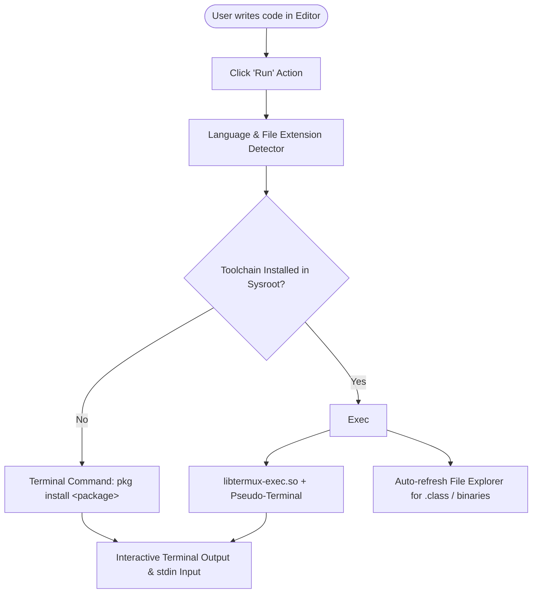

# CodeEditor IDE 🚀
### *A Powerful, Standalone Mobile IDE & Compiler for Android*

[](https://android.com)
[](#-supported-languages--compilers)
[](https://termux.dev)
[](#-building-from-source)
[](LICENSE)

---

## 🌟 Overview

**CodeEditor IDE** is a full-featured, self-contained development environment built specifically for Android devices. Unlike standard mobile code editors that rely on external cloud APIs or require users to separately install and configure third-party terminal apps, **CodeEditor IDE bundles its own embedded Linux userland environment**.

With a native interactive terminal, dynamic file explorer, and smart automated toolchain management, you can code, compile, debug, and run programs natively on your phone or tablet completely on-device.

---

## ✨ Key Features

### ⚡ Integrated Package Management
- When you click **Run**, the IDE checks whether the required compiler or runtime (e.g., `clang`, `openjdk-17`, `python`, `rust`, `nodejs`) is installed.
- If missing, the IDE automatically launches the installation command directly inside the integrated terminal session with stale dpkg lock prevention.
- Full interactive control over packages with `pkg install`, `pkg search`, and `pkg upgrade`.

### 💻 Unbuffered Real-Time Interactive I/O (C/C++ Fix)
- Solves the notorious standard library buffering issue where interactive prompts like `cout << "Enter a number: ";` or `printf(...)` would not appear until after user input was captured.
- Uses native `stdbuf -o0 -e0` zero-latency streams so user prompts display in real time with interactive `cin` / `scanf` stdin support.

### 🌐 Built-in Background Web Server
- For HTML, CSS, and JavaScript projects, the IDE launches a lightweight local HTTP server (`python -m http.server 8080 &`) safely in the background.
- Your terminal remains completely interactive and unblocked.
- Includes a 1-tap browser preview button for instant real-time web rendering.

### 📁 Dynamic File Explorer & Class Sync
- Create, rename, delete, and organize files and nested directories.
- Automatically synchronizes compilation outputs (such as Java `.class` files, e.g., `Student.class`, C/C++ compiled binaries) directly in the file explorer tree for full transparency.
- Intelligent Java class detection automatically matches file naming conventions with `public class <Name>`.

### 🎨 Modern Code Editor & Terminal
- Syntax highlighting across multiple programming languages.
- Configurable editor settings: adjust font sizes (`12px`, `14px`, `16px`, `18px`, `20px`) and color themes.
- Full VT100 / ANSI escape sequence terminal emulation with a virtual extra-keys bar (`Tab`, `Ctrl`, `Alt`, `ESC`, `|`, `~`, `/`, `-`).

---

## 🛠️ Supported Languages & Compilers

| Language | Environment / Package | Compiler / Command | Execution Mode |
| :--- | :--- | :--- | :--- |
| **C** | `clang` | `clang -Wall -O2 file.c -o file` | Unbuffered Native Binary |
| **C++** | `clang` | `clang++ -std=c++17 file.cpp -o file` | Unbuffered Native Binary |
| **Java** | `openjdk-21` / `openjdk-17` | `javac File.java && java File` | Bytecode on JVM |
| **Python** | `python` | `python3 -u file.py` | Direct Script Runner |
| **JavaScript** | `nodejs` | `node file.js` | V8 Engine |
| **TypeScript** | `nodejs` + `ts-node` | `npx ts-node file.ts` | On-the-fly Compilation |
| **Go** | `golang` | `go run file.go` | Direct Native Runner |
| **Rust** | `rust` | `rustc file.rs -o file && ./file` | Native Machine Code |
| **Kotlin** | `kotlin` | `kotlinc file.kt -include-runtime -d file.jar` | JVM Archive Runner |
| **C#** | `mono` | `mcs file.cs && mono file.exe` | Mono CLI Runtime |
| **PHP** | `php` | `php file.php` | CLI Interpreter |
| **Ruby** | `ruby` | `ruby file.rb` | MRI Interpreter |
| **Lua** | `lua54` | `lua file.lua` | Standalone Interpreter |
| **HTML/CSS/JS**| `python` | `python -m http.server 8080 &` | Background Web Server |

---

## 🏗️ Architecture & How It Works



1. **Embedded Linux Environment**: The app extracts an internal Linux rootfs (arm64-v8a / armeabi-v7a / x86_64) into the app's sandboxed private storage directory (`/data/data/com.termcode.ide/files/usr`).
2. **Terminal Subsystem**: Integrates a custom Termux terminal emulator view connected via Linux PTY (pseudo-terminal) using Android NDK shared libraries.
3. **Execution Pipeline**: `BaseRunner` implementations translate source files into compiled binaries or interpreted scripts with custom stream buffering configurations.

---

## 📂 Project Structure

```text
termcode-ide/
├── app/
│   ├── src/
│   │   ├── main/
│   │   │   ├── java/com/termcode/ide/
│   │   │   │   ├── MainActivity.java        # Core IDE coordinator & layout controller
│   │   │   │   ├── editor/                  # Code editor view & syntax highlighter
│   │   │   │   ├── terminal/                # Termux terminal session, view, & PTY client
│   │   │   │   ├── runner/                  # Language runners (C, C++, Java, Python, etc.)
│   │   │   │   ├── explorer/                # File tree explorer & storage manager
│   │   │   │   └── settings/                # Settings dialogs & preferences
│   │   │   ├── res/                         # UI layouts, mipmap icons, values, & styles
│   │   │   └── AndroidManifest.xml          # Permissions & launcher configuration
│   │   └── build.gradle.kts                 # Module-level Gradle configuration
├── gradle/                                  # Gradle wrapper binaries & setup
├── build.gradle.kts                         # Top-level build configuration
├── settings.gradle.kts                      # Project settings & plugin declarations
└── README.md                                # Project documentation
```

---

## 🚀 Building from Source

### Prerequisites
- **Android Studio**: Android Studio Hedgehog / Iguana / Ladybug or newer
- **JDK**: Java Development Kit 17 or higher
- **Android SDK**: API Level 34 (Android 14) with NDK installed

### Build Steps

1. **Clone the repository:**
   ```bash
   git clone https://github.com/raj40870-pixel/code-eidter-app.git
   cd code-eidter-app
   ```

2. **Open in Android Studio:**
   - Select **Open an Existing Project** and navigate to the cloned folder.
   - Let Gradle sync all dependencies automatically.

3. **Build Debug APK via Terminal:**
   ```bash
   # On Windows PowerShell / Command Prompt
   .\gradlew assembleDebug

   # On Linux / macOS
   ./gradlew assembleDebug
   ```

4. **Locate Generated APK:**
   - The compiled debug APK will be created at:
     ```
     app/build/outputs/apk/debug/app-debug.apk
     ```

---

## 🤝 Contributing

Contributions, bug reports, and feature requests are welcome!
Feel free to open an issue or submit a pull request:

1. Fork the Project
2. Create your Feature Branch (`git checkout -b feature/AmazingFeature`)
3. Commit your Changes (`git commit -m 'Add some AmazingFeature'`)
4. Push to the Branch (`git push origin feature/AmazingFeature`)
5. Open a Pull Request

---

## 📄 License

This project is licensed under the [MIT License](LICENSE).
Built with passion for mobile developers and student coders worldwide! 💻📱
