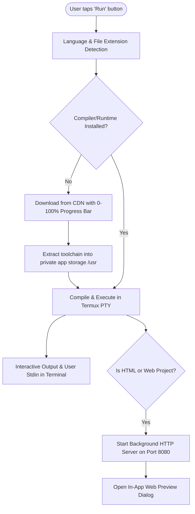

# CodeEditor IDE 🚀
### *A Powerful, Standalone Multi-Language Mobile IDE & Compiler for Android*

[](https://code-eidter-apk-website.vercel.app/)
[](https://code-eidter-apk-website.vercel.app/apk/CodeEditor-v1.3.4.apk)
[](https://code-eidter-apk-website.vercel.app/apk/CodeEditor-v1.3.4.apk)
[](https://android.com)
[](#-supported-languages--starter-files)
[](https://github.com/raj40870-pixel/library)
[](LICENSE)

---

## 🌐 Official Website & Direct APK Download

Visit our official web portal for setup tutorials, interactive screenshots, and one-tap APK installation:

- 🔗 **Official Website**: [https://code-eidter-apk-website.vercel.app/](https://code-eidter-apk-website.vercel.app/)
- ⬇️ **Direct APK Download (v1.3.4)**: [Download CodeEditor-v1.3.4.apk](https://code-eidter-apk-website.vercel.app/apk/CodeEditor-v1.3.4.apk) *(3.23 MB, Clean Signed Build)*
- 🗃️ **Compiler Toolchains CDN**: [Library Toolchain Packages](https://github.com/raj40870-pixel/library)

---

## 🚀 What's New in Version 1.3.4 (Latest Release)

- ⏱️ **Code Execution Timer & Exit Code Benchmark**:
  Real-time execution duration benchmark (with millisecond precision) and process exit code are automatically printed in the terminal upon program completion (`[⚡ Finished in 0.18s | Exit code 0]`).
- 🎨 **5 Professional Dark Code Editor Themes**:
  Personalize your editor from **Settings -> Themes**:
  - **VS Code Dark**: The classic, beloved developer dark theme.
  - **Dracula**: High-contrast dark theme with vibrant purples, pinks, and cyans.
  - **Monokai Pro**: Warm, focused aesthetic with crisp syntax contrast.
  - **One Dark Pro**: Atom-inspired balanced pastel color palette.
  - **Matrix Neon**: Cyberpunk terminal style with electric-green glow.
- ⚡ **Smart Auto-Closing Brackets & Quotes**:
  Automatic pair completion for `()`, `{}`, `[]`, `""`, and `''`. Pressing **Enter** inside `{}` automatically produces a standard 4-space indented block with the closing bracket placed neatly on the next line.
- 🧹 **Clean & Distraction-Free Mobile Toolbar**:
  Streamlined toolbar layout designed specifically for fast mobile coding without cluttered floating buttons.
- 🔄 **In-App Direct Auto-Update Engine (`versionCode: 9`)**:
  Check for the latest updates directly from the app's three-dots (⋮) menu. Seamlessly downloads APK updates with a live 0%–100% progress dialog and launches the package installer.
- ⚡ **SELinux W^X Permission Compatibility (SDK 28)**:
  Corrected execution policy targeting Android SDK 28, completely resolving SELinux `Permission denied (error 13)` when running offline compilers (Clang, GCC, OpenJDK, Python, Rust, Go, Node.js).
- 📁 **Smart Binary Isolation (`.bin_cache`)**:
  Compiled artifacts (`main.out`, `.class` binaries) automatically route to a hidden cache directory (`$HOME/.bin_cache`). Your project workspace remains 100% clean.
- ⏳ **24-Hour Binary Auto-Purge Policy**:
  Compiled artifacts older than 24 hours in `.bin_cache` are automatically cleaned up on launch, saving device storage.
- ↔️ **Smooth Horizontal Code Scrolling & Multi-Touch Scaling**:
  Two-dimensional panning with pinned line numbers and fluid pinch-to-zoom editor font scaling.

---

**CodeEditor IDE** is an all-in-one, standalone development environment designed specifically for Android smartphones and tablets. It combines a feature-rich multi-tab code editor, a full-featured Linux terminal subsystem, and an automated cloud compiler package manager.

Unlike ordinary mobile editors that rely on remote cloud compile servers or require third-party terminal apps, **CodeEditor IDE executes code directly on your device** inside a secure sandboxed Linux userland environment.

---

## 🛠️ Supported Languages & Starter Files

CodeEditor IDE comes pre-configured with templates, syntax highlighting, and automated execution runners for all major programming languages:

| Language | Default Filename | Compiler / Runtime | Execution Mode | Description |
| :--- | :--- | :--- | :--- | :--- |
| **C** | `main.c` | Clang (LLVM) | Native ARM64 / x86 Binary | Real-time unbuffered interactive I/O (`printf`, `scanf`) |
| **C++** | `main.cpp` | Clang++ (C++17/20) | Native ARM64 / x86 Binary | Interactive I/O (`std::cout`, `std::cin`) |
| **C#** | `Program.cs` | Mono Compiler (`mcs`) | Mono CLI (`mono`) | .NET C# runtime execution |
| **Python** | `main.py` | Python 3.12+ | Direct Interpreter | Scientific & general scripting with unbuffered output (`-u`) |
| **Java** | `Main.java` | OpenJDK 21 (`javac`) | Java Virtual Machine (`java`) | Auto-matches `public class <Name>` file naming |
| **JavaScript** | `main.js` | Node.js (V8) | Node.js Runtime | Modern ES6+ JavaScript execution |
| **TypeScript** | `main.ts` | TypeScript (`ts-node`) | Node.js Runtime | Typed JavaScript execution |
| **Go** | `main.go` | Go Toolchain | `go run` | High-performance Go compiled execution |
| **Rust** | `main.rs` | Rustc (LLVM backend) | Native Binary | Direct Rust compilation and execution |
| **Kotlin** | `Main.kt` | Kotlin Compiler (`kotlinc`) | JVM Archive Runner | Native Kotlin on OpenJDK JVM |
| **PHP** | `index.php` | PHP 8+ | PHP CLI Interpreter | Server-side scripting |
| **Ruby** | `main.rb` | Ruby 3+ | Ruby MRI Interpreter | Script execution |
| **Lua** | `main.lua` | Lua 5.4 | Lua Standalone | Lightweight scripting |
| **HTML / Web** | `index.html` | Background Web Server | Live In-App Browser Preview | **HTML, CSS (`style.css`), & JavaScript** integrated with live localhost web preview |
| **Full-Stack Node.js** | `package.json` | Node.js + NPM | `npm install && npm start` | Runs full-stack backend servers & web apps |

> [!NOTE]
> For **HTML / Web projects**, a single project seamlessly runs **HTML, CSS (`style.css`), and JavaScript (`main.js` / `script.js`)** together. The IDE automatically boots an in-app background web server and opens a live interactive browser preview dialog.

---

## ✨ Key Features

- **⚡ Zero-Config Toolchain Installer**:
  When you tap **Run**, the IDE checks whether the required compiler or interpreter is installed. If missing, a clean **0%–100% progress dialog** automatically downloads and configures the optimized toolchain directly from the CDN and runs your code instantly upon completion.
- **💻 Embedded Terminal & Linux Userland**:
  Full ANSI/VT100 terminal emulation powered by a native pseudo-terminal (PTY) and Linux userland. Supports standard shell commands, file operations, and package management.
- **📁 Smart File Explorer & Multi-Tab Editor**:
  - Open, create, rename, and delete files and folders.
  - Multi-tab file switching with automatic unsaved-change protection.
  - Device storage integration: open folders and files directly from your phone's storage.
  - Class & binary synchronization: compiled `.class` and `.out` files appear live in the file tree.
- **🌐 In-App Web Preview**:
  Instant live preview for HTML/CSS/JS web pages with refresh, back, and address bar controls.
- **🚀 Full-Stack Node.js Support**:
  Detects `package.json`, automatically runs `npm install` (if `node_modules` is missing), and starts your server via `npm start`.

---

## 🏗️ Architecture & How It Works



---

## 📦 How to Build APK from Source

Follow these simple steps to clone the repository and build your own APK:

### 1. Prerequisites
- **Git**: Installed on your system ([Download Git](https://git-scm.com/))
- **Java Development Kit (JDK)**: JDK 17 or higher ([Download JDK](https://adoptium.net/))
- **Android Studio** (Recommended): Hedgehog / Iguana / Ladybug or newer ([Download Android Studio](https://developer.android.com/studio))
  - Android SDK Platform 34 (Android 14)
  - Android SDK Build-Tools 34.0.0
  - NDK (Side by side)

---

### 2. Clone the Repository

Open your terminal or command prompt and run:

```bash
git clone https://github.com/raj40870-pixel/code-eidter-app.git
cd code-eidter-app
```

---

### 3. Build the Debug APK

#### Option A: Using the Command Line (Fastest)

**On Windows (PowerShell or Command Prompt):**
```powershell
.\gradlew assembleDebug
```

**On Linux or macOS:**
```bash
chmod +x gradlew
./gradlew assembleDebug
```

#### Option B: Using Android Studio
1. Open Android Studio.
2. Click **File -> Open...** and select the cloned `code-eidter-app` folder.
3. Wait for Gradle sync to complete.
4. From the top menu, select **Build -> Build Bundle(s) / APK(s) -> Build APK(s)**.

---

### 4. Locate Your Generated APK

Once the build finishes successfully, your APK will be ready at:

```text
app/build/outputs/apk/debug/app-debug.apk
```

You can now transfer `app-debug.apk` to any Android device running Android 8.0 (Oreo) or higher and install it!

---

## 📂 Project Structure

```text
code-eidter-app/
├── app/
│   ├── src/
│   │   ├── main/
│   │   │   ├── java/com/example/
│   │   │   │   ├── MainActivity.java               # Main IDE controller, tabs & lifecycle
│   │   │   │   ├── editor/                         # Code editor component & highlighter
│   │   │   │   ├── runner/                         # Language runners (C, C++, Java, Rust, Go, Python, etc.)
│   │   │   │   │   ├── TemplateManager.java        # Starter code templates for all languages
│   │   │   │   │   ├── GoRunner.java               # Go compilation & execution runner
│   │   │   │   │   └── RunManager.java             # Extension-to-runner dispatcher
│   │   │   │   ├── terminal/                       # Termux terminal session, PTY & environment
│   │   │   │   │   ├── TermuxEnvironment.java      # Environment paths & variables
│   │   │   │   │   ├── TermuxBootstrapInstaller.java # Rootfs setup & initialization
│   │   │   │   │   └── ToolchainInstaller.java     # Automated toolchain package manager
│   │   │   │   └── ui/                             # File explorer tree & editor tab adapters
│   │   │   ├── res/                                # Layouts, icons, themes, and UI resources
│   │   │   └── AndroidManifest.xml                 # App permissions, activities & orientation config
│   │   └── build.gradle.kts                        # Module build configuration & dependencies
├── gradle/                                         # Gradle wrapper files
├── build.gradle.kts                                # Root build configuration
├── settings.gradle.kts                             # Project settings
└── README.md                                       # Complete documentation
```

---

## 📄 License

This project is open-source and available under the [MIT License](LICENSE).
Built with ❤️ for programmers, students, and mobile developers worldwide! 💻📱
